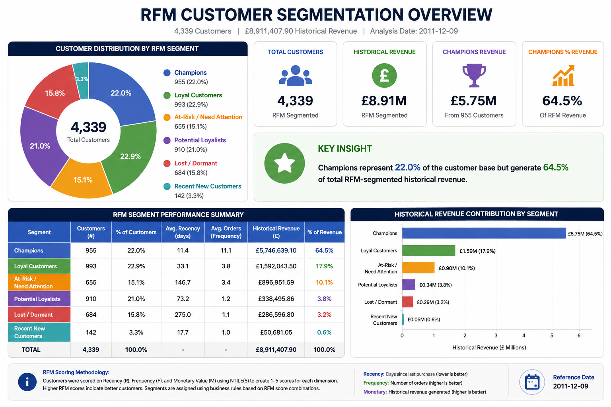
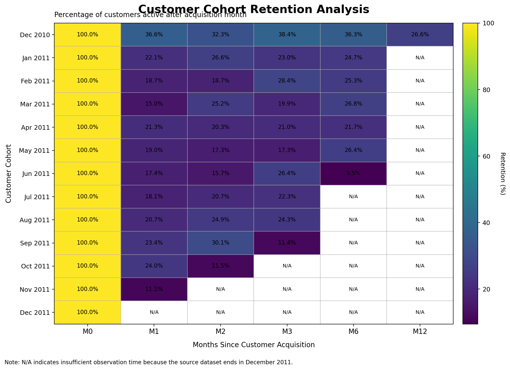
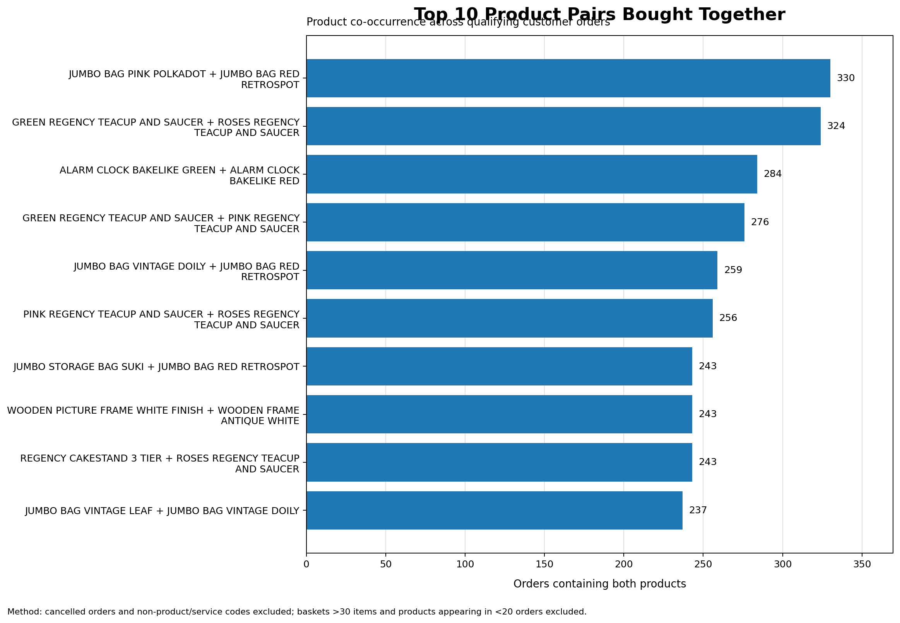

# E-Commerce Customer Analytics & Business Intelligence

## PostgreSQL Analytics Case Study

**Steven Ochieng Otiende**
**Data Analyst | Business Intelligence Analyst | Statistics & Performance Analytics Specialist**

**Tools:** PostgreSQL | SQL | RFM | Cohort Analysis | Market Basket Analysis

---

## Executive Summary

I used **PostgreSQL and advanced SQL** to analyze **541,909 transaction records** from the UCI Online Retail dataset, transforming raw transactional data into insights around **sales performance, customer value, retention, and product purchasing behavior**.

The project demonstrates an end-to-end analytics workflow covering:

* Data cleaning and validation
* Business KPI analysis
* RFM customer segmentation
* Cohort retention analysis
* Product-pair analysis
* SQL performance optimization
* Business recommendations

### Key Results

| Metric                         |            Result |
| ------------------------------ | ----------------: |
| Transaction records            |       **541,909** |
| Fulfilled orders               |        **22,064** |
| Identified customers           |         **4,339** |
| Calculated transaction revenue |       **£10.64M** |
| Peak revenue month             | **November 2011** |
| Peak monthly revenue           |        **£1.51M** |
| RFM Champions                  | **955 customers** |
| Champions' revenue share       |         **64.5%** |
| At-Risk customers              |           **655** |
| Dec. 2010 M12 retention        |         **26.6%** |
| Top product-pair co-occurrence |    **330 orders** |

---

# 1. Business Problem

The business had a large historical transaction dataset but needed answers to five practical questions:

1. **How is sales performance changing over time?**
2. **Which customers generate the most value?**
3. **Which customers are at risk of becoming inactive?**
4. **How effectively are customers retained after their first purchase?**
5. **Which products are frequently purchased together?**

The goal was to turn transactional data into **actionable business intelligence for customer retention, revenue growth, and cross-selling**.

---

# 2. Analytical Workflow

```text
Raw Transaction Data
        ↓
PostgreSQL Staging
        ↓
Data Cleaning & Validation
        ↓
Business KPI Analysis
        ↓
RFM Segmentation
        ↓
Cohort Retention
        ↓
Market Basket Analysis
        ↓
SQL Optimization
        ↓
Business Recommendations
```

---

# 3. Data Preparation

The source CSV presented an encoding issue because some fields contained the **£ currency symbol**.

Instead of importing directly into typed analytical columns, I created a **text-based staging table**, imported the source using Windows-1252-compatible encoding, and then explicitly converted fields into appropriate PostgreSQL data types.

The workflow included:

* Data type conversion
* Text cleaning
* Timestamp transformation
* NULL handling
* Customer ID validation
* Cancellation handling
* Index creation
* Data-quality checks

**SQL:** [`01_data_cleaning.sql`](scripts/01_data_cleaning.sql)

### What this demonstrates

**Practical data engineering and SQL problem-solving before analysis begins.**

---

# 4. Sales Performance

### Findings

* **22,064 fulfilled orders**
* **4,339 identified customers**
* **£10.64M calculated transaction revenue**
* **November 2011** was the highest-revenue month.
* Peak monthly revenue reached **£1.51M**.

### Business Insight

The strong November performance indicates meaningful seasonal demand.

### Recommendation

Use historical seasonality to support:

* Inventory planning
* Marketing campaigns
* Staffing
* Fulfillment capacity
* Promotional timing

**SQL:** [`02_business_kpis.sql`](scripts/02_business_kpis.sql)

---

# 5. RFM Customer Segmentation

I used **Recency, Frequency, and Monetary value (RFM)** to classify customers according to purchasing behavior.

PostgreSQL's `NTILE(5)` window function was used to score customers into quintiles.

### Customer Segments

| Segment                  | Customers | Avg. Orders | Historical Revenue |
| ------------------------ | --------: | ----------: | -----------------: |
| Champions                |   **955** |        11.1 |         **£5.75M** |
| Loyal Customers          |       993 |         3.8 |             £1.59M |
| At-Risk / Need Attention |   **655** |         3.4 |           £896.95K |
| Potential Loyalist       |       910 |         1.2 |           £338.50K |
| Lost / Dormant           |       684 |         1.1 |           £286.60K |
| Recent New Customers     |       142 |         1.0 |            £50.68K |

### Key Finding

**Champions represented approximately 22% of RFM-segmented customers but generated 64.5% of RFM-segmented historical revenue.**

### Business Action

Prioritize:

* Champion retention
* At-Risk customer reactivation
* Second-purchase campaigns for newer customers
* Personalized customer offers

**SQL:** [`03_rfm_segmentation.sql`](scripts/03_rfm_segmentation.sql)



---

# 6. Cohort Retention

Customers were grouped by their **first purchase month** and tracked across subsequent months.

### Key Finding

The December 2010 cohort contained:

**885 customers**

After 12 months:

**235 customers remained active**

### M12 Retention: **26.6%**

### Business Action

Cohort analysis provides a framework for:

* Improving customer onboarding
* Increasing repeat purchases
* Designing lifecycle campaigns
* Comparing retention across customer cohorts

> **Note:** Retention measures active customers, not revenue. M12 retention is only observable where the dataset provides a complete 12-month observation window.

**SQL:** [`04_cohort_retention.sql`](scripts/04_cohort_retention.sql)



---

# 7. Market Basket Analysis

I analyzed product co-occurrence within qualifying orders to identify products frequently purchased together.

The process included:

* Removing cancelled transactions
* Excluding service/postage items
* Deduplicating invoice-product combinations
* Filtering unusually large baskets
* Filtering low-frequency products
* Self-joining products within invoices
* Ranking product pairs

### Top Product Pair

**JUMBO BAG PINK POLKADOT + JUMBO BAG RED RETROSPOT**

**330 qualifying orders**

### Business Action

The findings can support:

* Cross-selling
* Product bundles
* "Complete the set" recommendations
* Multi-buy promotions
* Merchandising
* Checkout recommendations

> **Note:** This is product co-occurrence analysis rather than full association-rule mining. Support, confidence, and lift were not calculated.

**SQL:** [`05_market_basket_analysis.sql`](scripts/05_market_basket_analysis.sql)



---

# 8. SQL Performance Optimization

The original product-pair approach involved an expensive self-join across transaction data.

I reduced the computational workload by:

1. Removing cancelled transactions.
2. Excluding non-merchandise items.
3. Deduplicating invoice-product combinations.
4. Creating a temporary analytical table.
5. Adding a composite index on `(invoiceno, stockcode)`.
6. Filtering unusually large baskets.
7. Restricting product candidates to frequently occurring products.
8. Performing the self-join after these reductions.

### Measured Performance

| Operation                        | Approximate Time |
| -------------------------------- | ---------------: |
| Temporary table + index creation |      **~12 sec** |
| Optimized basket query           |      **~17 sec** |

### Technical takeaway

This demonstrates practical PostgreSQL optimization through **data reduction, temporary tables, indexing, and efficient join design**.

---

# 9. Business Insights

### Customer Value

A relatively small group of highly engaged customers generated a disproportionate share of historical customer revenue.

**Action:** Protect high-value customers through targeted retention strategies.

### Customer Retention

The December 2010 cohort retained **26.6% of customers at M12**.

**Action:** Strengthen post-purchase engagement and repeat-purchase programs.

### Customer Reactivation

**655 customers** were classified as At-Risk / Need Attention.

**Action:** Develop targeted reactivation campaigns based on previous purchasing behavior.

### Product Cross-Selling

The strongest product pair occurred together in **330 qualifying orders**.

**Action:** Use product relationships to inform bundles and recommendations.

### Seasonal Planning

November generated approximately **£1.51M**, the highest monthly revenue in the dataset.

**Action:** Incorporate seasonal patterns into inventory and marketing planning.

---

# 10. Technical Skills Demonstrated

### PostgreSQL & SQL

* CTEs
* Window functions
* `NTILE()`
* `RANK()`
* Aggregations
* Conditional aggregation
* `CASE`
* Date/time functions
* Self-joins
* Temporary tables
* Views
* Indexing
* Data type conversion
* NULL handling

### Analytics

* KPI analysis
* Customer segmentation
* RFM analysis
* Cohort analysis
* Retention analysis
* Product affinity analysis
* Data-quality validation
* Business interpretation

### Performance

* Query optimization
* Composite indexing
* Dataset reduction
* Join optimization
* Analytical execution-time measurement

---

# 11. Key Business Recommendations

Based on the analysis, the business should consider:

**1. Protect Champions**
Develop loyalty and personalized retention strategies for high-value customers.

**2. Reactivate At-Risk Customers**
Target customers showing declining engagement with relevant offers and recommendations.

**3. Increase Second Purchases**
Use post-purchase campaigns to move new customers toward repeat purchasing.

**4. Build Product Bundles**
Use frequently co-purchased products to create targeted bundles and cross-sell opportunities.

**5. Plan for Seasonal Demand**
Use historical revenue patterns to improve inventory, marketing, and operational planning.

---

# 12. Limitations

* The dataset covers only **December 2010–December 2011**.
* Customer analysis is limited to transactions with available `CustomerID`.
* Missing Customer IDs should not automatically be interpreted as guest customers.
* RFM Monetary values represent historical transaction value, not predicted Customer Lifetime Value.
* Cohort retention measures active customer retention rather than revenue retention.
* M12 retention is unavailable for cohorts without a complete observation window.
* Product-pair analysis measures co-occurrence rather than full association rules.
* Support, confidence, and lift were not calculated.
* `DOTCOM POSTAGE` is included in revenue analysis but excluded from product-pair analysis.

---

# 13. Future Enhancements

Potential extensions include:

* Customer Lifetime Value modeling
* Churn prediction
* Revenue forecasting
* Product demand forecasting
* Association-rule mining using support, confidence, and lift
* Customer clustering
* Power BI executive dashboard
* Automated customer recommendation models

---

# 14. Project Structure

```text
sql-ecommerce-analytics/
│
├── README.md
├── CASE_STUDY.md
├── LICENSE
│
├── scripts/
│   ├── 01_data_cleaning.sql
│   ├── 02_business_kpis.sql
│   ├── 03_rfm_segmentation.sql
│   ├── 04_cohort_retention.sql
│   └── 05_market_basket_analysis.sql
│
├── assets/
│   ├── rfm_customer_segment_chart.png
│   ├── cohort_retention_chart.png
│   └── market_basket_chart.png
│
└── dataset/
    └── README.md
```

---

# 15. Conclusion

This project demonstrates an end-to-end **PostgreSQL analytics workflow**, from raw data preparation through advanced customer and product analysis.

The strongest business finding was the concentration of historical customer value: **Champions represented approximately 22% of RFM-segmented customers while generating 64.5% of historical RFM-segmented revenue**.

The analysis also identified clear opportunities around **customer retention, reactivation, cross-selling, and seasonal planning**.

More importantly, the project demonstrates the ability to move beyond SQL query writing and use data to answer **practical business questions and support decision-making**.

---

## 👨‍💻 Author

### Steven Ochieng Otiende

**Data Analyst | Business Intelligence Analyst | Statistics & Performance Analytics Specialist**

**Core Tools:** PostgreSQL | SQL | Python | Power BI | Excel | R | STATA | SPSS

### Portfolio Focus

> **Turning transactional data into reliable analysis, business intelligence, and actionable business decisions using SQL.**
